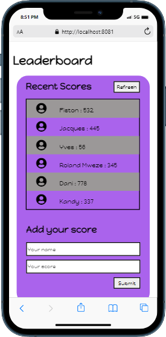

#  Leaderboard

The leaderboard website displays scores submitted by different players. It also allows you to submit your score. All data is preserved thanks to the external Leaderboard API service

## Built With

- Major languages: JAVASCRIPT | HTML | CSS 
- Technologies used : Git | Github | Linter | Webpack

## Live Demo

[In progress live link](https://rolandm99.github.io/Leaderboard/dist)

## Getting Started

To get a local copy up and running follow these simple example steps.

1. First clone the project with the command git clone https://github.com/RolandM99/Leaderboard.git
2. Then run the command `npm install` in your terminal to install all package
3. run `npm start` for starting the project in your browser
4. [optional] You can even fork the project

👤 **Authour:** **Roland Manful Mweze**

- GitHub: [Rolandm99](https://github.com/RolandM99)
- Twitter: [@Manfulmwez](https://twitter.com/ManfulMwez)
- LinkedIn: [Roland N. MWEZE](https://www.linkedin.com/in/roland-n-mweze-8b1045189/)

## 🤝 Contributing

Contributions, issues, and feature requests are welcome!

Feel free to check the [issues page](../../issues/).

## Show your support

Give a ⭐️ if you like this project!

## 📝 License

This project is [MIT](./MIT.md) licensed.

